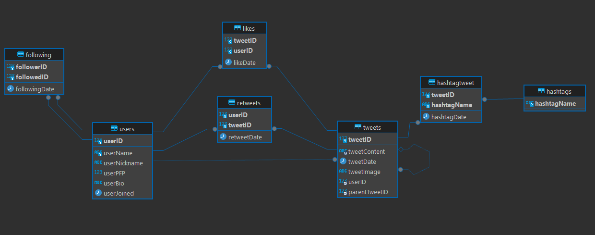
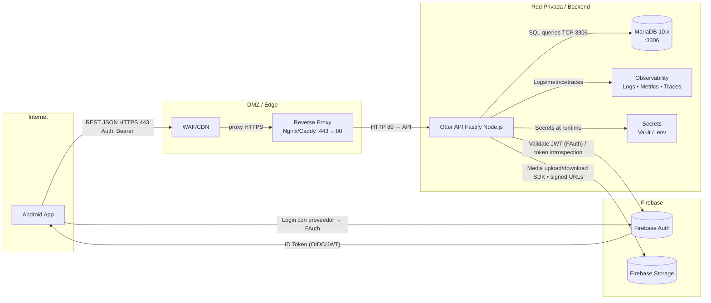

  

<h1 align="center">Otter API 🦦</h1>

  <em>Backend de <strong>Otter</strong>, una réplica minimalista de Twitter. 
  Construido con Node.js, MariaDB y arquitectura RESTful.</em>

---

## 🚀 Descripción

**Otter API** es el motor que gestiona usuarios, tweets, likes, retweets y follows.  
Diseñado para ser escalable, limpio y modular. Backend para la aplicación móvil de Otter en Android.

---

## 🗃️ Modelo de Datos

### Diagrama Relacional

  

---

## 🧩 Arquitectura

---

## 🧠 Stack Técnico

- **Node.js** + **Express/Fastify**
- **MariaDB**
- **Firebase Authentication** + **Cloud Storage**

---

## 🎬 Demo

